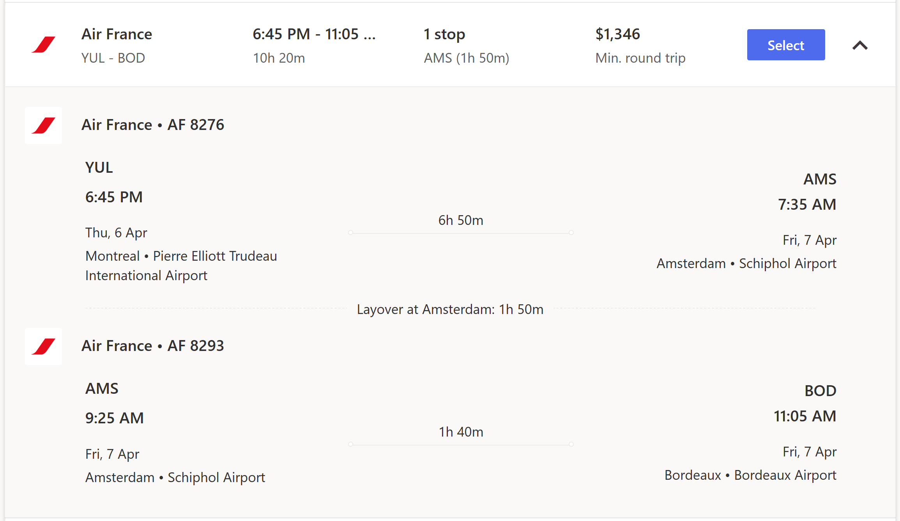

# Budgets

[menu principal](./readme.md)

### Sommaire

`les tarifs que nous avons pour l'instant à titre indicatif`

Joueur
- Repas : 400€
- Hébergement Cottage Saint Julien (5 ou 6 occupation) : 140€
- Minis-Bus : 95€
- Tournoi : 
- 
- Permis de voyage : 25$
- Assurance SSQ - Soccer Québec (coût IPE) : 66$
- Frais bancaire IBAN :
- Avion : 950$

Parent
- Hébergement Cottage Moulis/Sauternes (6 occupation) : 158€
- Minis-Bus : 95€
- 
- Frais bancaire (si par Visa) : 0$
- Avion 950$

### Détail

- Budget repas : 45€ jour x 8 ~ 360€ (+2x20€) = 400€ (600$)
  - Matin : ±5€
  - Midi : ±17€
  - Soir : ±23€
  - Il y a des cuisines et BBQ dans les cabines du village vacance et la possibilité de faire des repas.

- Déplacement (autocar)
  - 9 places
    - https://location-minibus-pas-cher-bordeaux.com/ 
    - moc.col-evitanretla@tcatnoc
  - jusqu'à 59 places
    - [option 1](https://www.cars-de-france.com/tarifs-location-autocar/)
    - [option 2](https://www.location-bus.fr/)
    - [option 3](https://locationminibus.fr/)
    - [option 4](https://www.sixt.fr/funnel/#/reservation/offerconfig?ctyp=van&minPs=7)

- Hébergement
  - yelloh village 
    - 5 ou 6 personnes
    - [occupation 5/6](https://www.yellohvillage.fr/camping/bordeaux_lac/nos_locations/75474#content)
    - 

- Avion
  - Air France via CDG (927$ - 942$)
    - 
  - Air France détail du vol
    - 

  - Air France via AMS
    - 

  - Delta (~883$ lorsque vérifier) --> delta revend Air France
    - 

---

`Exemple de vols/couts`
- avec British Airways (pas bon, long)
- avec Air Canada (à venir)
  - ne va pas jusqu'a bordeaux;
  - nous evons combiner avec air france.
- avec Corsair (pas disponible)
- avec transat (à venir)
  - ne va pas jusqu'a bordeaux;
  - heure d'arrivé imcompatible.

`Exemple Hébergements coûts/devis`
- 

- [1](https://www.yellohvillage.fr/camping/search?search_text=Cit%C3%A9+du+vin+Bordeaux&campings_content_ids=75198-2655-2656-5338&poi_id=40049&poi_latlong=44.862285%2C-0.550124&total_count_village=91&date_start=08%2F04%2F2023&date_end=15%2F04%2F2023&hebergement=rental_unit&nb_personnes=1)

---
