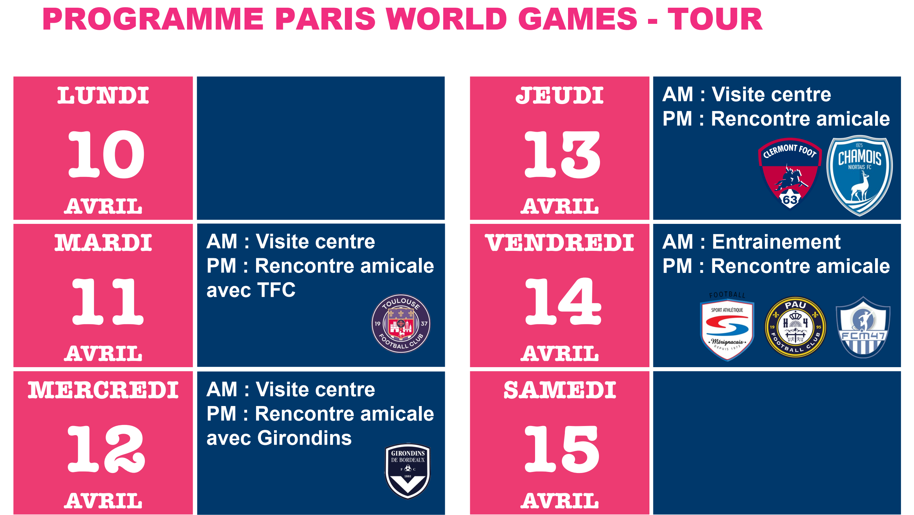
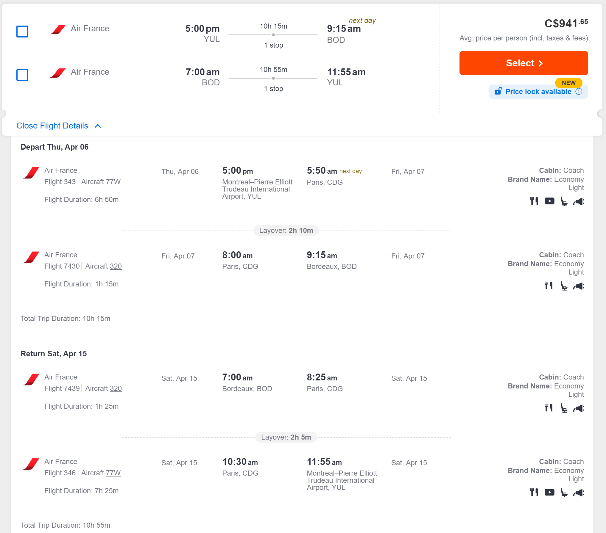
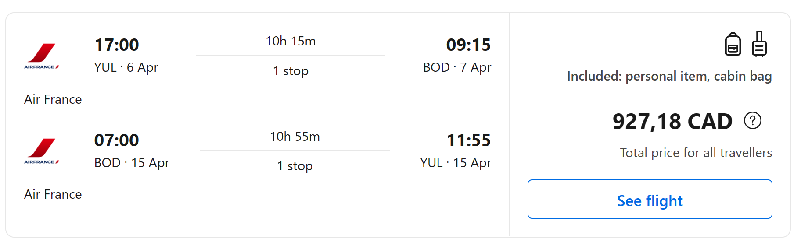
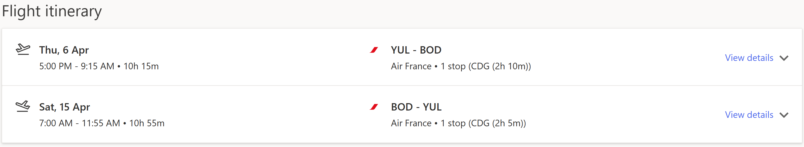

# Horaire

Janvier 2023
| Sun               | Mon               | Tue               | Wed               | Thu               | Fri               | Sat               |
| ----------------- | ----------------- | ----------------- | ----------------- | ----------------- | ----------------- | ----------------- |
| [1](#2023-01-01)  | [2](#2023-01-02)  | [3](#2023-01-03)  | [4](#2023-01-04)  | ⍟ [5](#2023-01-05)  | ⍟€ [6](#2023-01-06)  | ️⚽️ [7](#2023-01-07)  |
| [8](#2023-01-08)  | [9](#2023-01-09)  | [10](#2023-01-10) | [11](#2023-01-11) | ⍟ [12](#2023-01-12) | ⍟ [13](#2023-01-13) | [14](#2023-01-14) |
| [15](#2023-01-15) | [16](#2023-01-16) | [17](#2023-01-17) | [18](#2023-01-18) | € [19](#2023-01-19) | [20](#2023-01-20) | [21](#2023-01-21) |
| [22](#2023-01-22) | [23](#2023-01-23) | [24](#2023-01-24) | [25](#2023-01-25) | ⍟ [26](#2023-01-26) | [27](#2023-01-27) | [28](#2023-01-28) |
| [29](#2023-01-29) | [30](#2023-01-30) | [31](#2023-01-31) |                   |                   |                   |                   |

Février 2023
| Sun               | Mon               | Tue               | Wed               | Thu               | Fri               | Sat               |
| ----------------- | ----------------- | ----------------- | ----------------- | ----------------- | ----------------- | ----------------- |
|                   |                   |                   | [1](#2023-02-01)  | [2](#2023-02-02)  | [3](#2023-02-03)  | [4](#2023-02-04)  |
| [5](#2023-02-05)  | € [6](#2023-02-06)  | [7](#2023-02-07)  | [8](#2023-02-08)  | [9](#2023-02-09)  | [10](#2023-02-10) | [11](#2023-02-11) |
| [12](#2023-02-12) | [13](#2023-02-13) | [14](#2023-02-14) | [15](#2023-02-15) | [16](#2023-02-16) | [17](#2023-02-17) | [18](#2023-02-18) |
| [19](#2023-02-19) | [20](#2023-02-20) | [21](#2023-02-21) | [22](#2023-02-22) | [23](#2023-02-23) | [24](#2023-02-24) | [25](#2023-02-25) |
| [26](#2023-02-26) | [27](#2023-02-27) | [28](#2023-02-28) |                   |                   |                   |                   |

Marc 2023
| Sun               | Mon               | Tue               | Wed               | Thu               | Fri               | Sat               |
| ----------------- | ----------------- | ----------------- | ----------------- | ----------------- | ----------------- | ----------------- |
|                   |                   |                   | [1](#2023-03-01)  | [2](#2023-03-02)  | [3](#2023-03-03)  | [4](#2023-03-04)  |
| [5](#2023-03-05)  | € [6](#2023-03-06)  | [7](#2023-03-07)  | [8](#2023-03-08)  | [9](#2023-03-09)  | [10](#2023-03-10) | [11](#2023-03-11) |
| [12](#2023-03-12) | [13](#2023-03-13) | [14](#2023-03-14) | [15](#2023-03-15) | [16](#2023-03-16) | [17](#2023-03-17) | [18](#2023-03-18) |
| [19](#2023-03-19) | [20](#2023-03-20) | [21](#2023-03-21) | [22](#2023-03-22) | [23](#2023-03-23) | [24](#2023-03-24) | [25](#2023-03-25) |
| [26](#2023-03-26) | [27](#2023-03-27) | [28](#2023-03-28) | [29](#2023-03-29) | [30](#2023-03-30) | [31](#2023-03-31) |                   |

Avril 2023
| Mon             | Tue             | Wed             | Thu             | Fri             | Sat             | Sun             |
| --------------- | --------------- | --------------- | --------------- | --------------- | --------------- | --------------- |
|                 |                 |                 |                 |                 | [1](#20230401)  | [2](#20230402)  |
| [3](#20230403)  | [4](#20230404)  | [5](#20230405)  | 🛫 [6](#2023-04-06)  | 🛬 [7](#2023-04-07)  | 🏆 [8](#2023-04-08)  | 🏆 [9](#2023-04-09)  |
| ️⚽️ [10](#2023-04-10) | ️⚽️ [11](#2023-04-11) | ️⚽️ [12](#2023-04-12) | ️⚽️ [13](#2023-04-13) | ️⚽️ [14](#2023-04-14) | 🛫🛬 [15](#2023-04-15) | [16](#2023-04-16) |
| [17](#20230417) | [18](#20230418) | [19](#20230419) | [20](#20230420) | [21](#20230421) | [22](#20230422) | [23](#20230423) |
| [24](#20230424) | [25](#20230425) | [26](#20230426) | [27](#20230427) | [28](#20230428) | [29](#20230429) | [30](#20230430) |

#### 2023-01-05
demande de report du paiment au 19 janvier 2023

#### 2023-01-06
création du compte bancaire
**Paiement de l'insription** (ceci officialise l'inscription) 200€

#### 2023-01-07
rencontre avec parents avant le match

#### 2023-01-12
**lettre de consentement de voyage** [ici](https://voyage.gc.ca/voyager/enfant/lettre-de-consentement)

#### 2023-01-13
**passeport**
  1. Confirmation des passeports (date d'échéance);
  2. Confirmation que vous devez procéder à une demande (démarche) de passeport.

#### 2023-01-19
**Paiement du devis d'hébergement** (ceci officialise la réservation) 30% en Euros

#### 2023-01-26
**Identification de l'équipe de responsable**
 - Identification des coachs (2);
 - Identification des parents responsables (2);
 - Possiblement nous auront besoin de chauffeurs responsable des transports;
 - Les autres vous êtes des parents accompagnateurs 🥰, des supporteurs.

#### 2023-02-06
**Paiement du devis d'hébergement** 40% en Euros

#### 2023-03-06
**Paiement finale du devis d'hébergement** 30% en Euros

## Horraire du séjour
 
 **Proposition B (nouveau)**
 
Les vacances en France sont du 10 au 15 avril 2023 
Avantages :
- focus sur le soccer;
- possible de faire plus de matchs (5 au lieu de 2);
- plus de flexibilité 
  - et disponibilité des équipes;
  - pour les heures des matchs (matin ou en pm au lieu du soir apres 17h);
  - pour les activités.

#### 2023-04-06
  - départ ±17h00 à Dorval [voir référence](#références)
  - 
#### 2023-04-07
  - vers ±05h00 à Paris [voir référence](#références)
  - vers ±09h30 à Bordeaux [voir référence](#références)
  - vers ±10h30 : checkin dans les cabines [www.yellohvillage.fr](www.yellohvillage.fr)
  - Repas midi : au village
  - PM : Visite secrète du Matmut (car ils ne doivent pas dormir avant 21h)
  - Soir repas : Il y a un resto sur le site pour le repas du soir
  - Après repas : explication du séjour, directives et rafraichissement de l'attitude à avoir.
  - Apres après repas : parlons soccer
  - vers 21h00 : dodo

#### 2023-04-08
  - vers 7h00 : petit déjeuner dans les cabines
  - 2x Match de 50min (2x25) en 2022 --> https://fcmi-club.fr/bordeaux-ocean-cup-2022/
  - Surprise : aller voir le match des Girondins vs FC Bastia au Matmut

#### 2023-04-09
  - vers 7h00 : petit déjeuner dans les cabines
  - 2x Match de 50min (2x25) en 2022 --> https://fcmi-club.fr/bordeaux-ocean-cup-2022/

#### 2023-04-10
  - Trajet :
  - AM 
  - PM Match vs Mérignacais (U17 National)p
  - Soir : Repas resto du village vacance

#### 2023-04-11
  - Trajet : [map](https://www.google.ca/maps/dir/Yelloh!+Village+Camping+Bordeaux+Lac,+Bd+Jacques+Chaban-Delmas,+33520+Bruges,+France/Stadium+TFC,+All%C3%A9e+Gabriel+Bi%C3%A9n%C3%A8s,+Toulouse,+France/@44.2328105,-0.1782353,9z/data=!3m1!4b1!4m14!4m13!1m5!1m1!1s0xd5529b7feddf85f:0x6ea39e9257a69f49!2m2!1d-0.5827695!2d44.8977963!1m5!1m1!1s0x12aebb8442a6d3ad:0x258ae94747bde3cd!2m2!1d1.434048!2d43.5832972!3e0)
  - AM Visite du centre
  - Repas : au centre de formation
  - PM Match vs Toulouse (L1)p [team](https://toulousefc.com/fr/saison/u17/2022)
  - Soir : Repas resto du village vacance

#### 2023-04-12
  - Trajet : 
  - AM Visite du centre
  - PM Match vs Girondins (L2)p
  - Soir : Repas resto du village vacance

#### 2023-04-13
  - AM Visite du centre [team](https://www.chamoisniortais.fr/)
  - Repas : au centre de formation
  - PM Match vs Chamois Niortais FC (L2)p 
  - Soir : Repas resto du village

#### 2023-04-14
  - Trajet : 
  - AM 8h30 départ, trajet 1h30 + mise en forme [map](https://www.google.ca/maps/dir/Yelloh!+Village+Camping+Bordeaux+Lac,+Bd+Jacques+Chaban-Delmas,+33520+Bruges,+France/68+Rue+Michel+de+Montaigne,+47200+Marmande,+France/@44.6640106,-0.5433212,10z/data=!3m1!4b1!4m14!4m13!1m5!1m1!1s0xd5529b7feddf85f:0x6ea39e9257a69f49!2m2!1d-0.5827695!2d44.8977963!1m5!1m1!1s0x12aa8f8010d3d92f:0xb0e8ed7f01d0b724!2m2!1d0.1503589!2d44.5131261!3e0)
  - Repas : au CLUB
  - PM 15h30 Match vs FCM47 (National)t
  - Soir : Repas resto du village

#### 2023-04-15
  - transport vers aéroport de Bordeaux, retour vers Montréal

#### Extrait de la présentation (une proposition / ébauche)

#### Légende

- s à titre d'exemple
- p proposition
- t tentatif

## Horraire du séjour
  
  **Proposition A**
  
- 3 avril départ
  - vers 21h00 à Dorval
- 4 avril arrivé
  - vers 10h30 à Paris
  - vers 14h00 à Bordeaux
  - vers 15h00 Visite secrète du Matmut (car ils ne doivent pas dormir avant 21h)
  - vers 18h00 Visite/Souper : Cité du vin
  - vers 21h00 retour au camping : dodo
- 5 avril
  - AM
  - PM
  - Soir 17h+ : Match vs FMCI
- 6 avril
  - AM
  - PM
  - Soir 17h+ : Match vs Girondins
- 7 avril
  - AM :
  - PM :  
  - Soir 17h+ : Match vs
- 8 avril tournoi
  - 2 Match
- 9 avril tournoi
  - 2 Match
- 10 avril retour
  - transport pour plusieurs vers aéroport de Bordeaux

voici le tableau en 2022 : https://fcmi-club.fr/bordeaux-ocean-cup-2022/

---

## Joueurs

**Liste des retours sur le projet qui confirme la participation**

Joueur | Confirmé | Parents | Passeport | Lettre | Questions
:--- | :---: | :---: | :---: | :---: | :---
Emile | Oui B |        | | |
Aghilas | Oui A |  | | |
Yacoub | Oui |   | | |
Ewen | Oui B | 1 | | |
Yohan | Oui B | 14 | 4a.7m | |
Vinh | Oui B | 2 | 4a.6m | |
Sami | Oui B | 1 | 4a.2m| |
Joachim | Oui B | 2 | 4a.11m | |
William | Oui B |   | | |
Caleb | Oui | 1 ou 2 | | |
Luca | Oui |  | |  |
Cheick | Oui |   | | |
Liam | Oui B |  | | |
Ilyan | Oui B |  | | |
Elliot | Oui B |  |  |  |
Kristopher | Oui B |  |   |  |
Otoniel | Oui B |  | |  |
Théo | Oui | 1 | |  |
Daniel | Oui | |  |  |
Isaak | Oui B | 1 |  |  |
   |  |   |  |  | 
Kevin | Coach      |       |  |  |
**Total**   |   **20J+1C**   |  **11**   |  |  |

- `Passeport` nombre d'année.mois restant après le 16 avril 2023;
- 1 Question;
- 2 Verbale;
- 3 Besoin de quelques jours;
- 4 Possible.

### Levée de fonds (facultatif)

Les fonds vont a ceux qui participent.

- Dimanche 11 Décembre 2022 : 1122$
  - 10h @ 12h : 454$
    + Vinh
    + Emile
    + Sami
    + Yohan
    + Joachim
  - 13h @ 15h : 668$
    + Ilyan
    + Aghilas
    + Vinh
    + Yacoub
    + William
    + Joachim
    + Ewen

 - Samedi 17 décembre 2022 (Dix30 coin/SAQ): 1375$
   - 13h a 16h (complet)
     - Sami
     - Kristopher
     - Ewen
     - Yacoub
     - Ilyan
     - Aghilas
     - Otoniel
     - Théo
     - Daniel
     - Elliot

 - Jeudi 29 décembre 2022 (Adonis Montréal) : 691$ moins le don centraide (20$) --> 671$
   - 2001 Rue Sauvé Ouest, Montréal
   - nous devons avoir du monde pendant 5h
   - minimum de **`6`** personnes pour que l'événement ait lieu
   - avoir les chandails jaunes de match (obligatoire)
   - avoir une attitude irréprochable et une politesse exemplaire
     - vous avez la responsabilité de passer le message à vos enfants
   - 11h00 @ 16h00 (5h) Complet à 10
     - Kris
     - Yohan
     - Emile
     - Yacoub
     - Otoniel
     - Vinh
     - Luca
     - Daniel

 - Vendredi 30 décembre 2022 (Adonis Montréal) 931$ moins le don centraide (31$) --> 900$
   - 2001 Rue Sauvé Ouest, Montréal
   - nous devons avoir du monde pendant 5h
   - minimum de **`6`** personnes pour que l'événement ait lieu
   - avoir les chandails jaunes de match (obligatoire)
   - avoir une attitude irréprochable et une politesse exemplaire
     - vous avez la responsabilité de passer le message à vos enfants
   - 11h00 @ 16h00 (5h) complet à 10
     - Cheick
     - Yacoub
     - Otoniel
     - Vinh
     - Luca
     - Isaak
     - Daniel
     - Théo
     - Liam

#### Sommaire

| Nom           |  Total | PEI | 2022-12-11 AM | 2022-12-11 PM | 2022-12-17 | 2022-12-29 | 2022-12-30 |
|---------------|-------:|-----|--------------:|--------------:|-----------:|-----------:|-----------:|
|               |   4068 |     |           454 |           668 |       1375 |        671 |        900 |
|               |        |     |               |               |            |            |            |
| Yacoub B.     | 416.79 |     |               |         95.42 |     137.50 |      83.87 |        100 |
| Ilyan B.      | 232.92 |     |               |         95.42 |     137.50 |            |            |
| Luca B.       | 183.87 |     |               |               |            |      83.87 |        100 |
| Yohan B.      | 174.67 |     |         90.80 |               |            |      83.87 |            |
| Otoniel C.    | 321.37 |     |               |               |     137.50 |      83.87 |        100 |
| Theo C.       | 237.50 |     |               |               |     137.50 |            |        100 |
| Vinh F.       | 369.29 |     |         90.80 |         95.42 |            |      83.87 |        100 |
| William H.    |  95.42 |     |               |         95.42 |            |            |            |
| Cheick K.     |    100 |     |               |               |            |            |        100 |
| Emile M.      | 174.67 |     |         90.80 |               |            |      83.87 |            |
| Daniel M.     | 321.37 |     |               |               |     137.50 |      83.87 |        100 |
| Kristopher M. | 221.37 |     |               |               |     137.50 |      83.87 |            |
| Ewen N.       | 232.92 |     |               |         95.42 |     137.50 |            |            |
| Liam P.       |    100 |     |               |               |            |            |        100 |
| Aghilas S.    | 232.92 |     |               |         95.42 |     137.50 |            |            |
| Issak S.      |    100 |     |               |               |            |            |        100 |
| Sami T.       | 228.30 |     |         90.80 |               |     137.50 |            |            |
| Elliot V.     |  137.5 |     |               |               |     137.50 |            |            |
| Joachim V.    | 186.22 |     |         90.80 |         95.42 |            |            |            |

### Requis

1.	**Nous devons acheter des EUROS, svp garder l'oeil ouvert quand c'est bas, appeler moi.**
    1. Besoin d'une place pour échanger de l'argent.
2.	Il y a trois paiements pour l’aspect hébergement+repas+déplacement (environ ~600$EU --> ~900$CDN)
    1. Le prix inclus le cout pour deux coachs
    2.	Le prix sera revu/calculé, devis en cours de production
3.	Pour les billets d’avion :
    1.	Je vais faire une demande pour un prix de groupe (~900$CDN moins les rabais so possible)
    2.	Deux compagnies / agences seront contacter (je vous reviens en janvier)
    3.	Parents indiquez moi si vous avez un intérêt d’aller en France (facultatif)
4.	Demande de fond de groupe :
    1.	Nous allons tenter de contacter des agences (ville, député, ministre, entreprises) pour trouver des fonds;
    2.	Un volontaire est nécessaire.
5.	Pour ceux qui ont un passeport
    1.	le passeport doit être valide 6 mois après la date de retour.
6.	Pour ceux qui n’ont pas de passeport
    1.	Il est nécessaire d’avoir une date de voyage pour accélérer la demande;
    2.	Si la demande est faites 20 jours avant le départ c’est assez rapide.
7.	Demande pour le droit de jouer au soccer (à l’extérieur du Québec)
    1.	Pour les gens dans ARSRS ce sera fait pour vous (fait par CSL, à confirmer);
    2.	Les autres vous devez obtenir une lettre de votre Directeur Technique régional.
8.	Le droit de voyage pour jeune de 16 et moins
    1.	Un gabarit sera fourni par Luigi (merci Luigi) [disponible ici](https://voyage.gc.ca/voyager/enfant/lettre-de-consentement)

### Prochaines étapes (à venir)
 1. Choix du format de la compétition durant le séjour
    1. Matchs amicaux contre les académies;
    2. Matchs amicaux et tournoi le week-end.
 2. Choix du forfait pour les parents
    1. airb&b en solo ou a plusieurs;
    2. hotel;
    3. activités (vignobles, stades, visite (Andora ?, académies ?).
    4. des dates de retour personnalisées seront tentées avec notre arrangeur de voyage.
       1. Négociation de groupe pour obtenir un prix.
       2. Les parents qui voudraient aller en France, vous devez me prévenir.
 3. Mode de paiement, virement, compte bancaire.
    1. Nous allons bientot avoir besoin de qqc de formel pour suivre nos finances.
 4. Adonis Montreal
     1. Responsable Patricia Claros : 514.264.3027
     2. Confirmer la présence via courriel à Patricia et Guy.
 5. Adonis Brossard (date à confirmer)
     1. Papa Sami Talbi : 

### Questions

Voici mon planning avec **`OceanCup`** pour les prochains jours

- Communications 
  - Jeudi 15 décembre 10h45 ZOOM
  - Jeudi 22 décembre via courriel
  - Mercredi 28 décembre via zoom
- Questions:
  - Q. Quel est la marche à suivre complète, pour payer ?

  - Q. Quel est le lien, le login et le password pour accéder à l'application de gestion de l'équipe ?

  - Q. Lieu des matchs du tournoi (adresse, surface) ?
    
  - Q. Formule des matchs amicaux et Horaire et adresse des matchs ?
 
  - Q. Formule du tournoi *exemple l’horaire de l’an passé* ?
    - GF : https://fcmi-club.fr/bordeaux-ocean-cup-2022/
  - Q. Adresse du camping pour notre groupe ?

  - Q. Quels sont les services offerts (bobo de matchs, bobo en dehors, clinique ) ?
    - GF :
      - repas 3 par jour (dans la cabine le matin)
      - activités sur site (parc aquatique) village vacance
      - Jeune assuré par le forfait durant le jeu
      - Nous devons avoir une assurance medicale additionnelle
      - Physio et thérapeute fourni
  - Q. Est-ce possible de confirmer les service offert par courriel ?
    - (verbale uniquement).
  - Q. Le parc aquatique est ouvert au moment du séjour ?

  - Q. Y a t'il des responsables qui s'occupent de la sécurité des enfants ?
    - À priori il n'y a pas de service offert par OceanCup en ce qui concerne la sécurité.
    - Lieu privé, les responsables dorment dans des cabines autours des cabines des jeunes.
  - Q. Horaire du séjour (Option B est priorisée) (voir gabarit dans le site)
    - Option B :
    - Option A :
  - Q. Est-ce possible d'obtenir un premier jet des réponses d'ici le 26 Decembre 2022 ?

  - Q. Est-ce possible un deuxième jet le 28 décembre 2022 ?

### Références

`Exemple de vols/couts`
- avec Air France (2)

- Delta

- avec British Airways (pas bon, long)
- avec Air Canada (à venir)
- avec Corsair (pas disponible)
- avec transat (à venir)

`Exemple transport local`

- [1](https://www.cars-de-france.com/tarifs-location-autocar/)
- [2](https://www.location-bus.fr/)
- [3](https://locationminibus.fr/)

`Exemple Hébergements`

- [1](https://www.yellohvillage.fr/camping/search?search_text=Cit%C3%A9+du+vin+Bordeaux&campings_content_ids=75198-2655-2656-5338&poi_id=40049&poi_latlong=44.862285%2C-0.550124&total_count_village=91&date_start=08%2F04%2F2023&date_end=15%2F04%2F2023&hebergement=rental_unit&nb_personnes=1)
- [5 personnes](https://www.yellohvillage.fr/camping/bordeaux_lac/nos_locations/75474#content)

---
