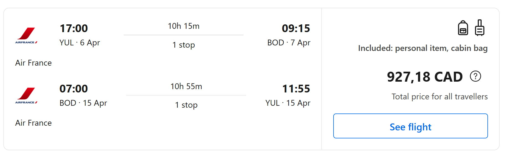
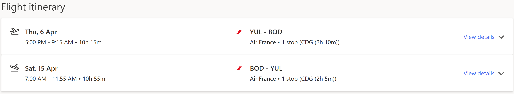

# Questions

Voici mon planning avec **`OceanCup`** pour les prochains jours

- Communications 
  - Jeudi 15 décembre 10h45 ZOOM
  - Jeudi 22 décembre via courriel
  - Mercredi 28 décembre via zoom

- Questions:
  - Q. Quel est la marche à suivre complète, pour payer ?

  - Q. Quel est le lien, le login et le password pour accéder à l'application de gestion de l'équipe ?

  - Q. Lieu des matchs du tournoi (adresse, surface) ?
    
  - Q. Formule des matchs amicaux et Horaire et adresse des matchs ?
 
  - Q. Formule du tournoi *exemple l’horaire de l’an passé* ?
    - GF : https://fcmi-club.fr/bordeaux-ocean-cup-2022/
  - Q. Adresse du camping pour notre groupe ?

  - Q. Quels sont les services offerts (bobo de matchs, bobo en dehors, clinique ) ?
    - GF :
      - repas 3 par jour (dans la cabine le matin)
      - activités sur site (parc aquatique) village vacance
      - Jeune assuré par le forfait durant le jeu
      - Nous devons avoir une assurance medicale additionnelle
      - Physio et thérapeute fourni
  - Q. Est-ce possible de confirmer les service offert par courriel ?
    - (verbale uniquement).
  - Q. Le parc aquatique est ouvert au moment du séjour ?

  - Q. Y a t'il des responsables qui s'occupent de la sécurité des enfants ?
    - À priori il n'y a pas de service offert par OceanCup en ce qui concerne la sécurité.
    - Lieu privé, les responsables dorment dans des cabines autours des cabines des jeunes.
  - Q. Horaire du séjour (Option B est priorisée) (voir gabarit dans le site)
    - Option B :
    - Option A :
  - Q. Est-ce possible d'obtenir un premier jet des réponses d'ici le 26 Decembre 2022 ?

  - Q. Est-ce possible un deuxième jet le 28 décembre 2022 ?

### Références

`Exemple de vols/couts`
- avec Air France (2)

- Delta

- avec British Airways (pas bon, long)
- avec Air Canada (à venir)
- avec Corsair (pas disponible)
- avec transat (à venir)

`Exemple transport local`

- [1](https://www.cars-de-france.com/tarifs-location-autocar/)
- [2](https://www.location-bus.fr/)
- [3](https://locationminibus.fr/)

`Exemple Hébergements`

- [1](https://www.yellohvillage.fr/camping/search?search_text=Cit%C3%A9+du+vin+Bordeaux&campings_content_ids=75198-2655-2656-5338&poi_id=40049&poi_latlong=44.862285%2C-0.550124&total_count_village=91&date_start=08%2F04%2F2023&date_end=15%2F04%2F2023&hebergement=rental_unit&nb_personnes=1)
- [5 personnes](https://www.yellohvillage.fr/camping/bordeaux_lac/nos_locations/75474#content)
